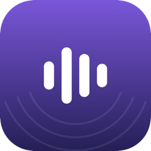
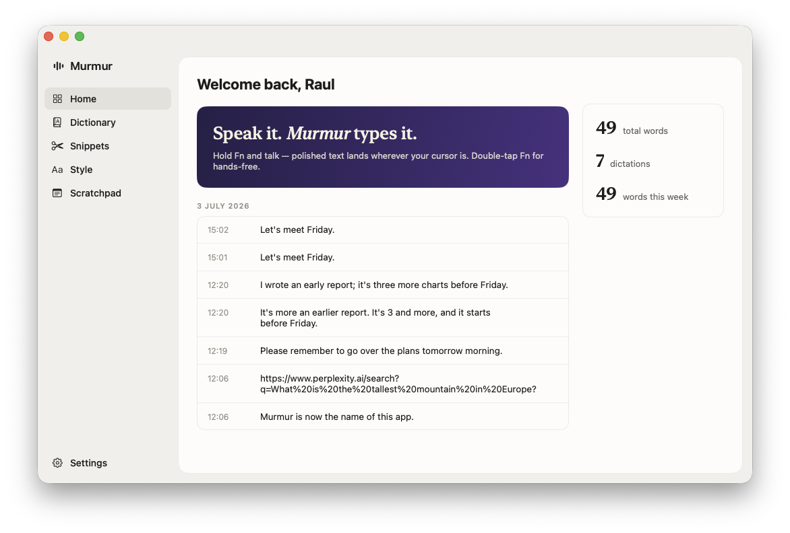
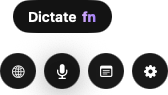
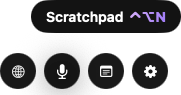
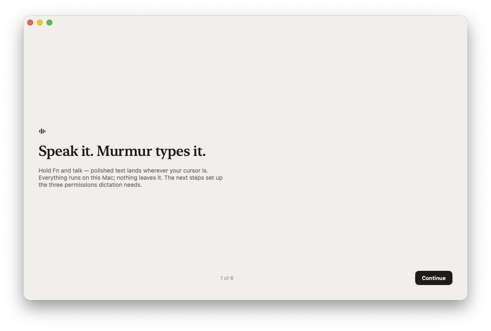
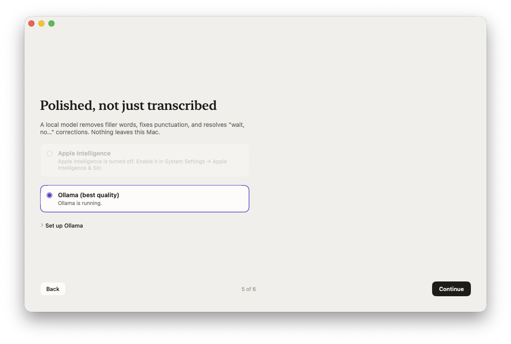

<div align="center">



# Murmur

**Speak it. Murmur types it.**

Hold a key, talk naturally, and polished text lands wherever your cursor is —
in any app. 100% on-device: your voice never leaves your Mac.




</div>

---

## Why Murmur

You talk ~4× faster than you type. Murmur turns that into usable text — not a
raw transcript. Say *"um so let's meet tuesday, wait no, friday"* and get
**"Let's meet Friday."**: fillers dropped, self-corrections resolved,
punctuation inferred, tone matched to the app you're dictating into.

- 🎙️ **Hold Fn, speak, release** — text appears at your cursor in any app
- 📼 **Recordings** — capture meetings (mic + system audio) or import Plaud
  exports; on-device transcription and local AI summaries (Ollama, LM Studio,
  or Claude), each auto-titled from its content
- ✅ **Tasks** — action items are pulled from recordings; you confirm the
  owners in a quick review, and they land in a built-in to-do list
- 🧠 **LLM polish, fully local** — Apple Intelligence out of the box, or a
  local [Ollama](https://ollama.com) model for the best quality
- 🔒 **Private by construction** — on-device speech recognition, on-device
  cleanup, no accounts, no telemetry. Nothing leaves this Mac — unless you
  enable Claude summaries, in which case transcripts (not audio) are sent
  to Anthropic
- 📚 **Learns your words** — dictionary, auto-learned spellings from your
  corrections, snippets ("my email address" → you@example.com), per-app tone
- ⚡ **Fast** — ~0.4 s from key-release to inserted text (warm)

## The pill

A quiet lozenge sits at the bottom of whichever screen your pointer is on.
Hover it and it splits, Dynamic-Island style, into quick actions — each one
explains itself. While you dictate it morphs into a live waveform with
cancel / confirm.

<div align="center">

| Hover | Explainers | Recording |
|:---:|:---:|:---:|
|  |  |  |

</div>

## Install

1. Download `Murmur-<version>.zip` from the [latest release](../../releases/latest) and unzip it.
2. Drag `Murmur.app` into **Applications**.
3. **Right-click → Open** the first time (Murmur isn't notarized; macOS blocks
   double-click opens of unidentified apps — right-click bypasses this once,
   permanently).
4. Follow the in-app setup. It walks you through the three permissions,
   picks a cleanup engine, and ends with your first dictation.

<div align="center">

<br><br>

</div>

### Requirements

- macOS 26+ on Apple Silicon
- For cleanup, one of:
  - **Apple Intelligence** enabled (zero setup — the default for new installs)
  - **[Ollama](https://ollama.com)** with the cleanup model
    (`ollama pull gemma4:e4b`) — best quality; the in-app setup can download
    the model for you

  Without either, Murmur still works — it inserts the raw on-device transcript.

## Usage

| Action | Trigger |
|---|---|
| Push-to-talk | **hold Fn**, speak, release |
| Hands-free toggle | **double-tap Fn** (stop with another double-tap or single press) |
| Cancel while recording | **Esc** |
| Command Mode (rewrite selection) | select text, **⌃⌥C**, speak an instruction ("make this more concise") |
| Command Mode (ask the web) | **⌃⌥C** with nothing selected, speak a question → opens a Perplexity search |
| Paste / copy last transcript | **⌃⌥V** / **⌃⌥X** |
| Scratchpad (brain-dump notes) | **⌃⌥N** or menu bar |
| Recent activity / View Diff | **⌃⌥D** or menu bar |
| "press enter" | say it at the very end of a dictation to submit (Slack, chat, etc.) |

Settings (menu bar → Settings…): language (picker of all on-device speech
locales), optional translation of output into another language, cleanup
engine, Ollama model/URL, shortcuts, dictionary, snippets, per-app-category
tone + writing samples, context awareness, history.

## Personalization that compounds

- **Auto-add to dictionary** (Settings → Personalization): correct a word
  Murmur inserted and the corrected spelling is learned automatically — it
  then biases both recognition and the cleanup pass.
- **Style samples**: paste an example of how you actually write per app
  category; it's injected into the cleanup prompt as a few-shot exemplar
  (a much stronger tone signal than the tone adjective).

## How it works

1. **Capture** — AVAudioEngine streams your mic to Apple's on-device
   `SpeechAnalyzer`/`SpeechTranscriber`, biased with your dictionary and
   on-screen proper nouns.
2. **Polish** — a local LLM applies a strict minimal-edit contract: your
   words, cleaned — never rewritten, never invented. A sanity guard falls
   back to the raw transcript if the model goes off-script.
3. **Insert** — Accessibility API with retries, synthetic-paste fallback, and
   clipboard + notification as the last resort. Dictation is never lost.

## Build from source

```bash
bash Scripts/make_app.sh          # release build + signed build/Murmur.app
open build/Murmur.app
swift test                        # unit tests (MurmurCore)
swift run Murmur --process-text "some raw text"   # pipeline smoke test, no mic
bash Scripts/make_release.sh 0.2.0                # distributable zip
```

Design docs live in `docs/superpowers/specs/`.

## Known limitations

- Undo forwards ⌘Z to the target app (relies on its undo stack).
- One language per session (pick it in Settings); no mid-sentence language
  switching or auto-detect — Apple's on-device transcriber is single-locale.
- Custom (non-standard) password fields may not be detected as secure — same
  documented limitation as the original.
- Not notarized (no Apple Developer Program) — hence the right-click-open
  dance on first launch.

---

<div align="center">
<sub>A personal, fully local clone of <a href="https://wisprflow.ai">Wispr Flow</a>, built for fun. Not affiliated.</sub>
</div>
